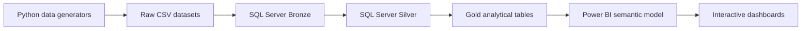

# Blue Canopy Business Intelligence Project

An end-to-end retail business intelligence project for **Blue Canopy Kenya**. It brings together synthetic operational data, a medallion-style data warehouse, a Power BI semantic model, and dashboards for exploring performance across the business.

The project follows data from its generation at source through warehouse preparation and modeling to the final analytics experience:

## Project goals

- Build a realistic, multi-domain retail dataset in a Kenyan business context.
- Demonstrate an end-to-end analytics workflow, from data generation to dashboard delivery.
- Organize warehouse data into Bronze, Silver, and Gold layers.
- Model business entities and facts for analysis in Power BI.
- Use measures, calculated columns, relationships, slicers, and visual analysis to make performance understandable and actionable.

## Data and business domains

The data covers the main activities of a multi-store retailer, including:

- **Sales:** point-of-sale and ecommerce transactions, order lines, returns, and gift cards.
- **Products and supply chain:** products, suppliers, purchase orders, receipts, inventory movements, and inventory snapshots.
- **Stores and geography:** store details, counties, and locations.
- **Finance:** store-level financial results and general-ledger transactions.
- **Customer experience and loyalty:** customer records, service interactions, feedback, loyalty activity, and gift-card usage.
- **Marketing and competition:** campaigns, promotions, competitor stores, quarterly competitor performance, and economic indicators.
- **People operations:** employee records, shifts, and time tracking.

Python generators use seeded, synthetic data to represent operational history and selected business realities such as changing dimensions and imperfect source records. The data is intended for learning and analytics development; it is not live Blue Canopy business data.

## Architecture and workflow

### 1. Generate source data with Python

The generator scripts are in [`raw_datasets/data_generation/`](raw_datasets/data_generation/). The master runner, [`run_all_generators.py`](raw_datasets/data_generation/run_all_generators.py), runs generators in dependency order. Generated raw CSV datasets are organized under [`raw_datasets/csv_files/`](raw_datasets/csv_files/).

The generators can produce large datasets, including transaction- and snapshot-level files with millions of rows. Check available disk space and review the generator documentation before running the full suite. Individual generators can be used when only a subset of the data is needed.

### 2. Load the Bronze layer

[`raw_datasets/load_bronze_tables.sql`](raw_datasets/load_bronze_tables.sql) contains SQL Server logic for loading raw CSV data into the warehouse Bronze schema. Bronze preserves source-shaped data for downstream transformation and traceability.

Before running it, configure the database and CSV root path for your environment. The script's default CSV path is machine-specific; SQL Server must also be able to access the configured files.

### 3. Transform data through Silver and Gold

[`raw_datasets/silver_stored_procedure.sql`](raw_datasets/silver_stored_procedure.sql) contains the Silver-layer transformation procedure. Silver applies the warehouse's cleaning and transformation rules to prepare data for analysis. Gold analytical tables provide the business-facing facts and dimensions consumed by the Power BI model.

The repository also includes warehouse exploration and connection assets under [`gold layer/`](gold%20layer/). SQL Server connection details should be configured locally and must not be committed if they contain credentials.

### 4. Model and analyze in Power BI

The Power BI project files are under [`power bi/`](power%20bi/). Open [`model.pbip`](power%20bi/model.pbip) in Power BI Desktop to work with the report and semantic model as a Power BI Project. The semantic model contains the dimensional and fact structures used to analyze retail performance; its measures and calculated columns provide reusable business calculations for report visuals.

The report is designed to support interactive analysis through KPI cards, charts, exception-focused tables, and filters. Dashboard areas include sales and profitability, inventory and supply chain, store financial performance, customer experience and loyalty, and marketing and competitive context.

## Repository guide

| Path | Contents |
| --- | --- |
| [`business_requirements/`](business_requirements/) | Business requirements and project brief |
| [`raw_datasets/data_generation/`](raw_datasets/data_generation/) | Python source-data generators, validation utilities, and generator documentation |
| [`raw_datasets/csv_files/`](raw_datasets/csv_files/) | Generated raw CSV inputs grouped by business domain |
| [`raw_datasets/load_bronze_tables.sql`](raw_datasets/load_bronze_tables.sql) | SQL Server Bronze loading logic |
| [`raw_datasets/silver_stored_procedure.sql`](raw_datasets/silver_stored_procedure.sql) | SQL Server Silver transformation procedure |
| [`bronze/`](bronze/) | Bronze-stage data extracts included in the workspace |
| [`gold layer/`](gold%20layer/) | Gold-layer connection and exploration assets |
| [`power bi/`](power%20bi/) | Power BI Project, report, semantic model, and related assets |
| [`power+claude/`](power%2Bclaude/) and [`retail_sales/`](retail_sales/) | Additional Power BI project copies and working artifacts |
| `*.drawio`, `*.svg`, `*.html` | Architecture diagrams and standalone dashboard/design mockups |

## Getting started

1. Clone the repository and review the business brief and data-generator documentation.
2. Prepare a Python environment with the packages required by the generators (including pandas, NumPy, and Faker).
3. Configure the SQL Server database connection and data paths for your machine.
4. Generate the source CSV files, or use the CSVs already provided when suitable.
5. Run the Bronze load and Silver transformation scripts in SQL Server; build or refresh the Gold analytical tables for the model.
6. Open `power bi/model.pbip` in Power BI Desktop, configure the model's data connection, and refresh the semantic model.
7. Explore the report pages and filter the visuals to investigate the business questions.

The full data-generation and warehouse workflow has significant storage and compute requirements. Start with a small subset when testing a new environment.

## Data quality and interpretation

The project includes both validation utilities and intentionally realistic source-data imperfections. Data quality checks and reconciliation are part of the analytics workflow, not a substitute for it.

Some cross-source comparisons—particularly inventory receipts versus movement quantities and store financial expenses versus general-ledger movements—have shown differences that still need investigation. Treat those comparisons as known validation items and avoid interpreting them as reconciled financial or operational totals until the source definitions are reviewed.

When a benchmark or attribution is not present in the model, report assumptions explicitly rather than presenting them as authoritative targets. For example, competitor-only market-share observations do not establish Blue Canopy's own market share, and campaign spend alone does not establish promotion ROI.

## Tools and technologies

- **Python** for synthetic data generation and validation.
- **Pandas, NumPy, and Faker** for data creation and handling.
- **Microsoft SQL Server / T-SQL** for warehouse loading and transformations.
- **Power BI Desktop** for the semantic model, DAX calculations, and interactive reports.
- **Power BI Project (PBIP)** for report and model definitions stored as project files.

## Status

This is an evolving portfolio and analytics project. Data generation, warehouse development, semantic modeling, and dashboard design are all represented in the repository; the workflow and data quality checks continue to be refined.
