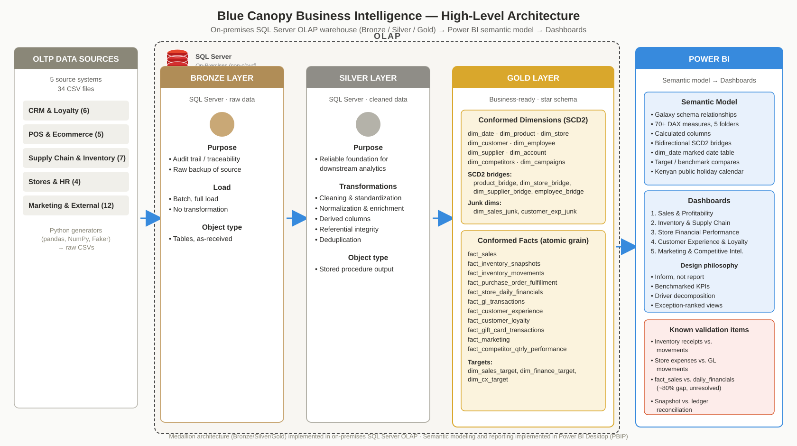
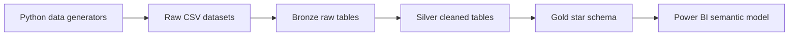
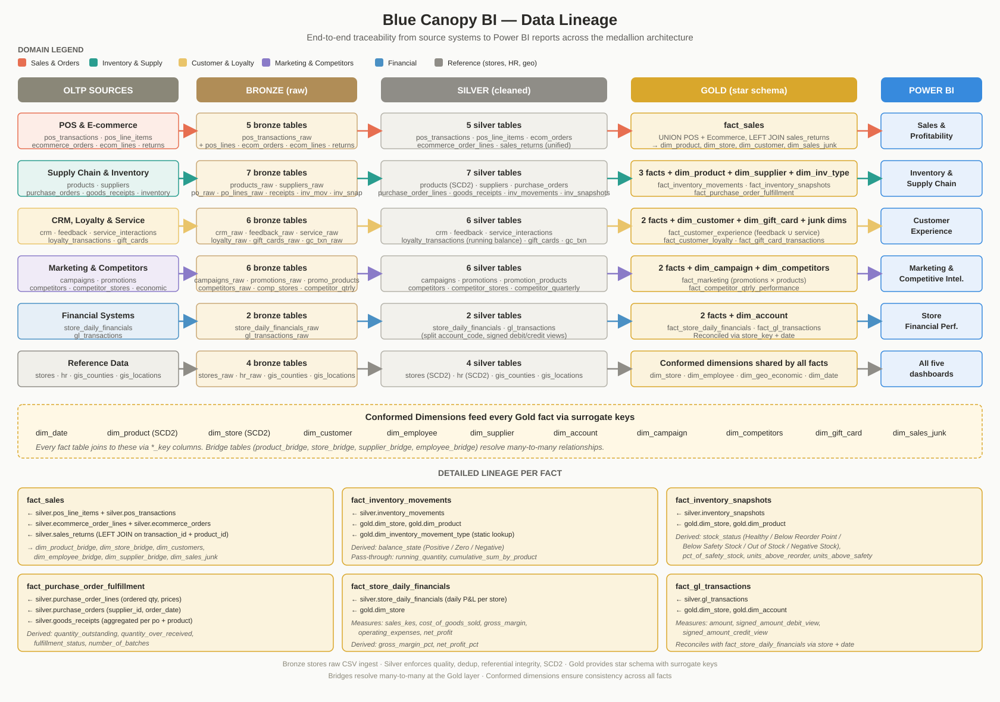

# Blue Canopy Data Warehouse

The data warehouse for the **Blue Canopy Business Intelligence Project**. It implements a medallion-style architecture in Microsoft SQL Server, transforming raw synthetic CSV datasets into a business-ready star schema consumed by the Power BI semantic model.

This directory contains the SQL Server DDL, load procedures, and transformation logic that move data from **Bronze → Silver → Gold**, along with the architecture and lineage diagrams used to document the flow.

---

## Architecture



The warehouse is organized into three layered schemas inside a single SQL Server database (`Blue_canopy`):

| Layer | Purpose | Schema | Approx. object count | Load pattern |
| --- | --- | --- | --- | --- |
| **Bronze** | Raw, source-shaped ingest | `bronze` | 34 tables ending in `_raw` | Full reload from CSV, no transformation |
| **Silver** | Cleaned, standardized, enriched | `silver` | 34 curated tables | One stored procedure, full reload |
| **Gold** | Business-ready star schema | `gold` | ~40 dimensions, facts, bridges, junk dims | One script per object, full reload |

The full flow is:



---

## Data lineage



The lineage diagram traces each business domain end-to-end through the four warehouse layers: OLTP sources → Bronze → Silver → Gold → Power BI. Every Silver table maps to exactly one Bronze source (with deduplication and quality filters applied), while Gold facts consolidate multiple Silver tables.

A text version of the same information appears in the [Data lineage reference](#data-lineage-reference) section at the bottom of this file.

---

## Folder structure

```
data_warehouse/
│
├── README.md                         ← this file
├── high_level_architecture.svg       ← medallion architecture diagram
├── data_lineage.svg                  ← domain → layer → report lineage
│
├── bronze/
│   ├── database_init.sql             ← create database, schemas, initial setup
│   ├── ddl.sql                       ← CREATE TABLE statements for all _raw tables
│   └── load_stored_procedure.sql     ← loads CSVs into Bronze tables
│
├── silver/
│   ├── Silver_Layer_Metadata_Dictionary.md   ← column-level documentation
│   ├── stored_procedure.sql          ← main Silver transformation procedure
│   └── <one .sql per silver table>   ← per-table scripts (for reference)
│                                       e.g. campaigns.sql, crm.sql, products.sql,
│                                            pos_transactions.sql, inventory_movements.sql, …
│
└── gold/
    ├── <dimension scripts>           ← e.g. dim_products.sql, dim_store.sql,
    │                                       dim_customers.sql, dim_employee.sql,
    │                                       dim_supplier.sql, dim_account.sql,
    │                                       dim_campaigns.sql, dim_promotions.sql,
    │                                       dim_competitors.sql,
    │                                       dim_inventory_movement_type.sql,
    │                                       date_dim.sql, counties_bridge.sql
    │
    ├── <bridge scripts>              ← e.g. dim_product_bridge.sql, dim_store_bridge.sql,
    │                                       dim_supplier_bridge.sql, dim_employee_bridge.sql
    │
    ├── <junk dimension scripts>      ← e.g. dim_sales_junk.sql, dim_customer_exp_junk.sql,
    │                                       customer_loyalty_junk.sql,
    │                                       marketing_factless_fact.sql
    │
    └── <fact scripts>                ← e.g. fact_sales.sql, fact_pos_sales.sql,
                                            fact_inventory_movements.sql,
                                            fact_inventory_snapshots.sql,
                                            fact_purchase_order_fulfillment.sql,
                                            fact_store_daily_financials.sql,
                                            fact_gl_transactions.sql,
                                            fact_customer_experience.sql,
                                            fact_customer_loyalty.sql,
                                            fact_gift_card_transactions.sql,
                                            fact_campaign.sql,
                                            fact_marketing.sql,
                                            fact_competitors.sql,
                                            fact_geo_economic.sql,
                                            competitor_qtrly_performance.sql
```

Notes on the layout:

- **Bronze** has three scripts: one to initialize the database, one to define tables, one to load them. This mirrors the one-time setup + repeatable load split.
- **Silver** has a single master procedure (`stored_procedure.sql`) that runs all transformations in order, plus individual per-table scripts kept for reference and review.
- **Gold** is flat — each Gold object has its own `.sql` file. There is no nested folder structure because the load order is defined by dependency (dimensions before facts), not by directory.

---

## Layer overview

### Bronze — `bronze` schema

Bronze is a faithful copy of the source CSV files. No cleaning, filtering, or renaming is applied. This layer is the audit trail — if anything in Silver or Gold is questioned, Bronze is the reference.

- **Inputs:** CSV files produced by the Python generators.
- **Outputs:** 34 tables named `<entity>_raw`.
- **Load procedure:** Defined in [`bronze/load_stored_procedure.sql`](bronze/load_stored_procedure.sql).
- **Behavior:** Full reload. Every run truncates and re-inserts. No incremental logic.
- **Data quality:** None applied. Deliberate imperfections injected by the generators include:
  - `-DUP` suffix duplicates
  - Invalid date sentinels (`2023-13-45`)
  - Sign errors on quantity fields
  - NULL values in required columns
  - Cross-store or cross-product leakage

### Silver — `silver` schema

Silver applies the warehouse's cleaning rules: deduplication, standardization, referential integrity, and enrichment. Every Silver table is a **freshly computed** version of its Bronze source.

- **Inputs:** Tables in `bronze`.
- **Outputs:** 34 tables in `silver`.
- **Load procedure:** [`silver/stored_procedure.sql`](silver/stored_procedure.sql).
- **Behavior:** Drop-and-recreate. Every Silver table is dropped and rebuilt from Bronze on each run.
- **Transformations applied:**
  - **Deduplication** — `-DUP` suffix records are removed
  - **Date normalization** — sentinel `2023-13-45` is replaced with a valid date
  - **Text standardization** — TRIM, title-case, and NULL handling
  - **Sign enforcement** — outbound movements become negative, inbound positive
  - **SCD2 detection** — products and stores are recognized as slowly-changing dimensions with `valid_from` / `valid_to` windows
  - **Derived columns** — tenure, margin bands, discount tiers, demand velocity, running balances, quality flags
  - **Referential enrichment** — customer primary store, order source type, account categorization
- **Column reference:** [`silver/Silver_Layer_Metadata_Dictionary.md`](silver/Silver_Layer_Metadata_Dictionary.md) documents every column.

### Gold — `gold` schema

Gold is the analytical star schema consumed by Power BI. It contains conformed dimensions, facts, bridge tables for many-to-many relationships, and junk dimensions for grouped categorical flags.

- **Inputs:** Silver tables, plus already-built Gold dimensions (for bridge resolution).
- **Outputs:** Dimensions, facts, bridges, junk dimensions, target tables.
- **Load pattern:** One `.sql` script per object, executed in dependency order.
- **Design principles:**
  - **Surrogate keys** — every dimension has a generated integer key
  - **Unknown members** — every dimension carries a `-1` placeholder row so facts never lose rows on join
  - **No business logic** — all cleaning happened in Silver; Gold only reshapes
  - **Conformed dimensions** — `dim_date`, `dim_products`, `dim_store` are shared across facts
  - **Bridge tables** — resolve SCD2 many-to-many relationships (product↔supplier, employee↔store)
  - **Junk dimensions** — collapse low-cardinality categorical columns into a single dimension

---

## Execution order

Run the warehouse in this sequence. Each step depends on the previous one.

```sql
-- 1. One-time setup
--    Run bronze/database_init.sql and bronze/ddl.sql
--    to create the database, schemas, and raw tables.

-- 2. Load Bronze from CSVs
--    Run bronze/load_stored_procedure.sql, then:
EXEC bronze.load_bronze_tables;

-- 3. Transform Bronze → Silver
--    Run silver/stored_procedure.sql, then:
EXEC silver.usp_LoadSilverLayer;

-- 4. Build Gold — dimensions first, then bridges, then facts.
--    Each .sql file in gold/ is a standalone script.
--    Run in this order:

--    4a. Standalone dimensions (no dependencies)
--        dim_products.sql, dim_store.sql, dim_customers.sql,
--        dim_employee.sql, dim_supplier.sql, dim_account.sql,
--        dim_campaigns.sql, dim_promotions.sql, dim_competitors.sql,
--        dim_inventory_movement_type.sql, date_dim.sql

--    4b. Junk dimensions
--        dim_sales_junk.sql, dim_customer_exp_junk.sql,
--        customer_loyalty_junk.sql

--    4c. Bridge tables (reference dimensions)
--        dim_product_bridge.sql, dim_store_bridge.sql,
--        dim_supplier_bridge.sql, dim_employee_bridge.sql

--    4d. Facts (reference dimensions and bridges)
--        fact_sales.sql, fact_pos_sales.sql,
--        fact_inventory_movements.sql, fact_inventory_snapshots.sql,
--        fact_purchase_order_fulfillment.sql,
--        fact_store_daily_financials.sql, fact_gl_transactions.sql,
--        fact_customer_experience.sql, fact_customer_loyalty.sql,
--        fact_gift_card_transactions.sql, fact_campaign.sql,
--        fact_marketing.sql, fact_competitors.sql,
--        fact_geo_economic.sql, competitor_qtrly_performance.sql

--    4e. Target tables
--        (sales, finance, CX targets if defined)

-- 5. Refresh Power BI
--    Open power bi/model.pbip and refresh the semantic model.
```

Facts that reference bridge tables must run after those bridges exist. Facts that reference dimensions must run after those dimensions exist.

---

## Data quality and known items

The warehouse includes deliberate source-data imperfections and reconciliation gaps that are **not bugs** — they are part of the analytical challenge the project is designed to explore.

Known validation items to be aware of when building reports:

- **Inventory receipts vs. movement quantities** — the receipt ledger and the movement ledger do not fully reconcile for all store-product pairs. The source definitions differ.
- **Store financial expenses vs. general-ledger movements** — the summary financial table and the ledger do not always agree, because they aggregate different transaction types.
- **`fact_sales` vs. `fact_store_daily_financials`** — there is an approximate 80% gap between sales-fact revenue and daily-financials revenue. This is unresolved and should be documented in any report that compares the two.
- **Snapshot vs. ledger inventory balance** — snapshots are the source of truth for stock levels; movements are the source of truth for velocity. Where the two diverge, prefer snapshots.

When in doubt, resolve these at the source rather than trying to reconcile them in the Gold layer.

---

## Connection and configuration

The warehouse runs on **on-premises SQL Server** (not Azure SQL, not Synapse). No cloud services are used at the warehouse layer.

To point your environment at the correct database:

1. Ensure SQL Server is installed and running locally (or on a network server reachable from your machine).
2. Create the `Blue_canopy` database if it does not exist — see `bronze/database_init.sql`.
3. Configure your SQL Server client (SSMS, Azure Data Studio, or sqlcmd) to connect.
4. Run the DDL and load scripts as described in [Execution order](#execution-order).

Connection strings and credentials must **not** be committed to the repository. Store them in a local config file or environment variables and reference those from your scripts.

---

## Tools and technologies

- **Microsoft SQL Server / T-SQL** — warehouse implementation, DDL, stored procedures, transformations
- **SQL Server Management Studio (SSMS)** — development and manual execution
- **CSV bulk load (BULK INSERT / OPENROWSET)** — Bronze ingest
- **Stored procedures** — Silver is a single procedure; Gold is script-per-object for traceability
- **Mermaid / SVG** — architecture and lineage documentation

---

## Status

This warehouse is part of an evolving portfolio project. The Bronze and Silver layers are complete and loadable end-to-end. The Gold layer is largely complete for the current set of dashboards; additional facts and target tables are added as new analytical questions are addressed.

Known validation items in the [Data quality](#data-quality-and-known-items) section are actively being worked on but are not blockers for dashboard development — they are documented explicitly so that consumers of the model understand what has and has not been reconciled.

---

## Data lineage reference

A compact text version of the lineage diagram, useful for debugging a specific metric.

### Data sources → Bronze

| Source system | Files | Bronze tables |
| --- | --- | --- |
| CRM & Loyalty (6) | crm, feedback, service_interactions, loyalty_transactions, gift_cards, gift_card_transactions | `crm_raw`, `feedback_raw`, `service_interactions_raw`, `loyalty_transactions_raw`, `gift_cards_raw`, `gift_card_transactions_raw` |
| POS & E-commerce (5) | pos_transactions, pos_line_items, ecommerce_orders, ecommerce_order_lines, returns | `pos_transactions_raw`, `pos_line_items_raw`, `ecommerce_orders_raw`, `ecommerce_order_lines_raw`, `returns_raw` |
| Supply Chain & Inventory (7) | products, suppliers, purchase_orders, purchase_order_lines, goods_receipts, inventory_movements, inventory_snapshots | `products_raw`, `suppliers_raw`, `purchase_orders_raw`, `purchase_order_lines_raw`, `goods_receipts_raw`, `inventory_movements_raw`, `inventory_snapshots_raw` |
| Stores & HR (4) | stores, hr, store_daily_financials, gl_transactions | `stores_raw`, `hr_raw`, `store_daily_financials_raw`, `gl_transactions_raw` |
| Marketing & External (12) | campaigns, promotions, promotion_products, competitor_quarterly, competitors, competitor_stores, gis_counties, gis_locations, economic | `campaigns_raw`, `promotions_raw`, `promotion_products_raw`, `competitor_quarterly_raw`, `competitors_raw`, `competitor_stores_raw`, `gis_counties_raw`, `gis_locations_raw`, `economic_raw` |

### Bronze → Silver

| Bronze source | Silver table | Key transformations |
| --- | --- | --- |
| `campaigns_raw` | `campaigns` | Channel default, duration, budget variance |
| `competitor_quarterly_raw` | `competitor_qtrly_performance` | Numeric casting, surrogate key |
| `competitors_raw` | `competitors` | Direct cast |
| `competitor_stores_raw` | `competitors_stores` | Deduplication on store ID, size normalization |
| `crm_raw` | `crm` | Name title-case, phone normalization, tenure, churn flag, primary store lookup |
| `feedback_raw` | `customer_feedback` | Rating label, sentiment, quality flag |
| `ecommerce_order_lines_raw` | `ecommerce_order_lines` | Discount analytics, duplicate line merge |
| `ecommerce_orders_raw` | `ecommerce_orders` | Comma-pattern unpacking to recover structured fields |
| `returns_raw` (POS) | `pos_returns` | Date fix, product `-DUP` strip |
| `returns_raw` (Ecom) | `ecommerce_returns` | Date fix, product `-DUP` strip |
| `economic_raw` | `economic` | Real retail index, composite health score, outlier flags |
| `gift_card_transactions_raw` | `gift_card_transactions` | Type reclassification, sign convention |
| `gift_cards_raw` | `gift_cards` | Direct cast, quote stripping |
| `gis_counties_raw` | `gis_counties` | Surrogate county key |
| `gl_transactions_raw` | `gl_transactions` | Account code split, signed debit/credit views, category |
| `goods_receipts_raw` | `goods_receipts` | Date fix, notes categorization, quality flag |
| `hr_raw` | `hr` | Date validation, education inference, tenure, retention risk |
| `service_interactions_raw` | `service_interactions` | Date fix, rating label |
| `inventory_movements_raw` | `inventory_movements` | Date fix, sign convention, running balance per product-store, demand velocity |
| `inventory_snapshots_raw` | `inventory_snapshots` | Date fix, dedupe on natural key, stock status |
| `gis_locations_raw` | `locations` | Dedupe by town |
| `loyalty_transactions_raw` | `loyalty_transactions` | Date fix, type normalization, running balance, redeem-exceeds-earned flag |
| `pos_line_items_raw` | `pos_line_items` | Product clean, campaign tag extraction, duplicate line merge |
| `pos_transactions_raw` | `pos_transactions` | Date/time split, walk-in default, payment method normalize, line-total reconciliation |
| `promotion_products_raw` | `promotion_products` | Quality flag, filter |
| `products_raw` | `products` | SCD2 detection, margin band, supplier fallback |
| `promotions_raw` | `promotions` | Duration, status, discount description, length tier |
| `purchase_order_lines_raw` | `purchase_order_lines` | Landed cost, VAT, duplicate line merge, line re-sequence |
| `purchase_orders_raw` | `purchase_orders` | Status category, action priority |
| `store_daily_financials_raw` | `store_daily_financials` | Direct cast |
| `stores_raw` | `stores` | Date fix, name rewrite, format backfill |
| `suppliers_raw` | `suppliers` | Phone/email cleanup |
| `pos_returns` + `ecommerce_returns` | `sales_returns` | UNION with source channel tag |

### Silver → Gold

#### Dimensions

| Silver source(s) | Gold object | Notes |
| --- | --- | --- |
| `products` | `dim_products` | SCD2 dimension with `valid_from` / `valid_to` |
| `stores` | `dim_store` | SCD2 dimension |
| `crm` | `dim_customers` | Customer master with segmentation |
| `hr` | `dim_employee` | Employee master with tenure, salary band |
| `suppliers` | `dim_supplier` | Supplier master with SCD2 |
| `gl_transactions` (distinct accounts) | `dim_account` | Chart of accounts with statement section |
| `campaigns` | `dim_campaigns` | Campaign master |
| `promotions` | `dim_promotions` | Promotion master |
| `competitors` | `dim_competitors` | Competitor master |
| `competitors_stores` | `competitors_stores` | Competitor store master |
| `gis_counties` | `counties_bridge` | Geographic bridge |
| static | `dim_inventory_movement_type` | Movement type lookup |
| generated | `date_dim` | Date spine |

#### Bridges

| Silver source(s) | Gold bridge |
| --- | --- |
| `products` + `suppliers` | `dim_product_bridge` |
| `stores` | `dim_store_bridge` |
| `suppliers` | `dim_supplier_bridge` |
| `hr` + `stores` | `dim_employee_bridge` |

#### Junk dimensions

| Silver source(s) | Gold junk dimension |
| --- | --- |
| `pos_transactions` + `ecommerce_orders` (categoricals) | `dim_sales_junk` |
| `customer_feedback` + `service_interactions` (categoricals) | `dim_customer_exp_junk` |
| `loyalty_transactions` (categoricals) | `customer_loyalty_junk` |

#### Facts

| Silver source(s) | Gold fact | Notes |
| --- | --- | --- |
| `pos_line_items` + `pos_transactions` + `ecommerce_order_lines` + `ecommerce_orders` + `sales_returns` | `fact_sales` | UNION POS + Ecom, LEFT JOIN returns |
| `pos_line_items` + `pos_transactions` | `fact_pos_sales` | POS-only subset for store-level analysis |
| `inventory_movements` | `fact_inventory_movements` | Join to `dim_products`, `dim_store`, `dim_inventory_movement_type` |
| `inventory_snapshots` | `fact_inventory_snapshots` | Join to `dim_products`, `dim_store` |
| `purchase_order_lines` + `purchase_orders` + `goods_receipts` | `fact_purchase_order_fulfillment` | Receipts aggregated per PO + product |
| `store_daily_financials` | `fact_store_daily_financials` | Daily P&L per store |
| `gl_transactions` | `fact_gl_transactions` | Join to `dim_account`, `dim_store` |
| `customer_feedback` + `service_interactions` | `fact_customer_experience` | Unified customer touchpoint ledger |
| `loyalty_transactions` + `gift_card_transactions` | `fact_customer_loyalty` | Combined loyalty activity |
| `gift_card_transactions` | `fact_gift_card_transactions` | Join to `dim_gift_card`, `dim_gift_card_type` |
| `promotions` + `promotion_products` | `fact_campaign` | Campaign / promotion performance |
| `promotions` + `promotion_products` | `marketing_factless_fact` | Promotion coverage (factless) |
| `campaigns` | `fact_marketing` | Campaign-level measures |
| `competitor_qtrly_performance` | `fact_competitors` + `competitor_qtrly_performance` | Competitor revenue and share |
| `economic` | `fact_geo_economic` | Macroeconomic indicators |
